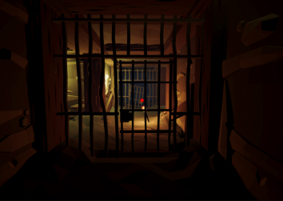
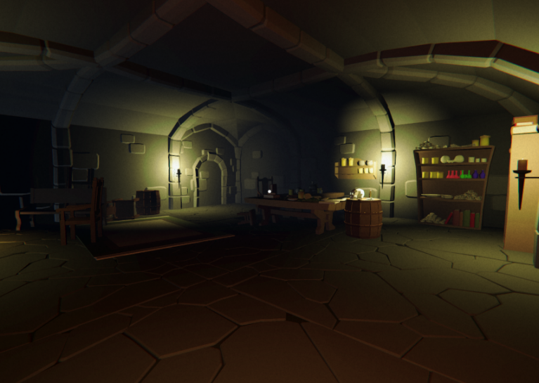
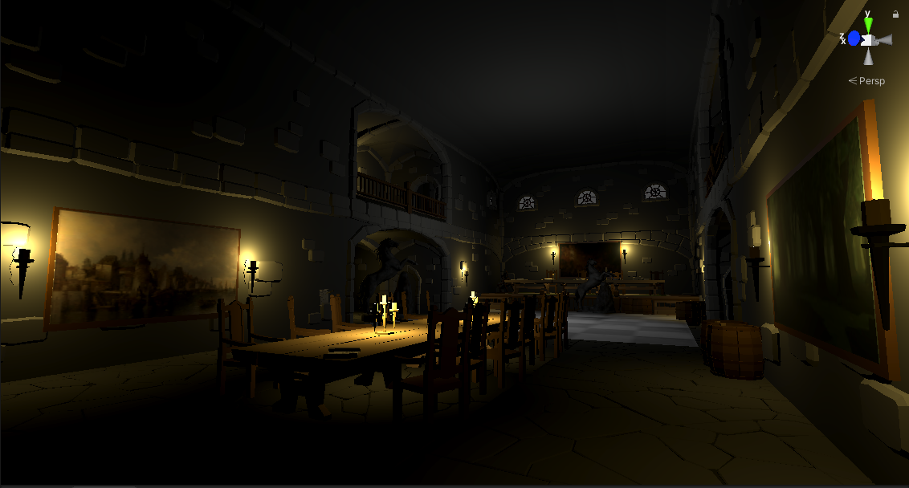
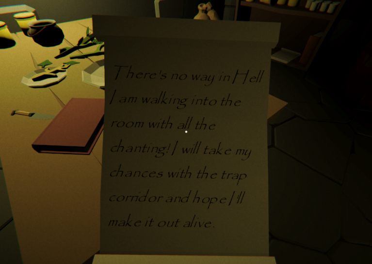
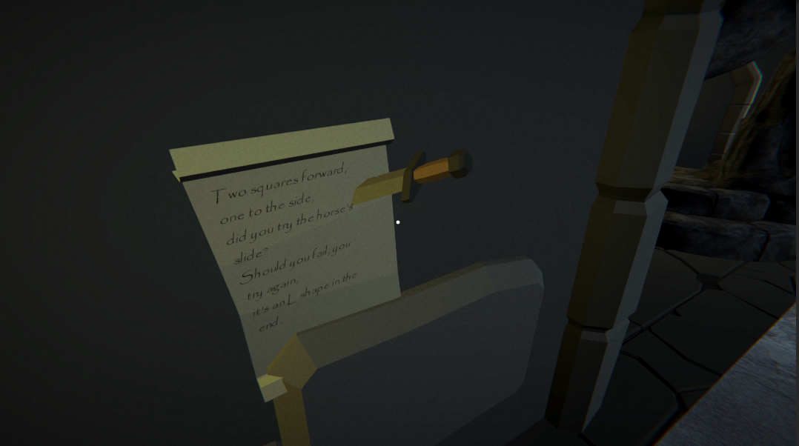
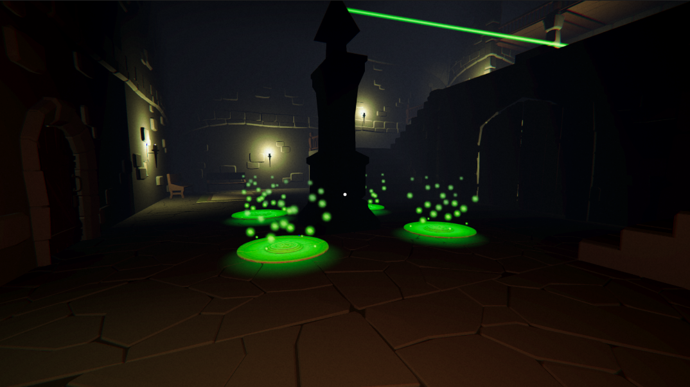
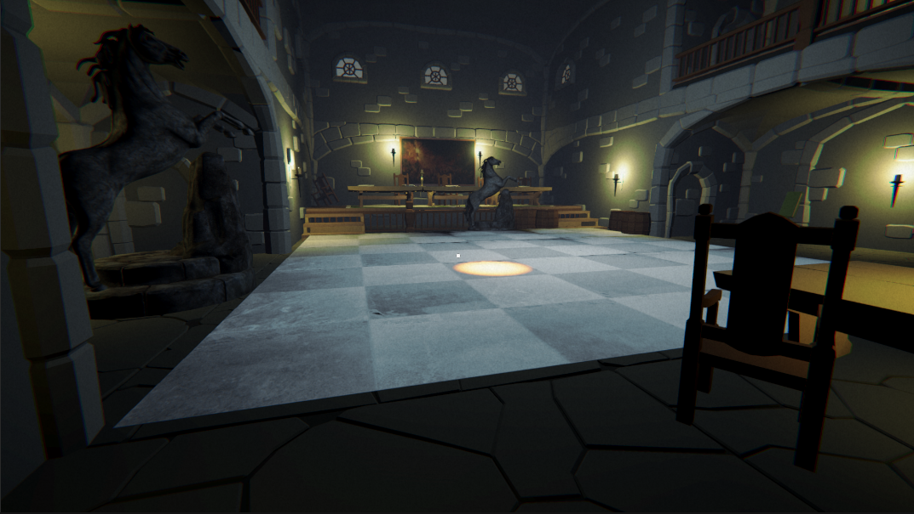
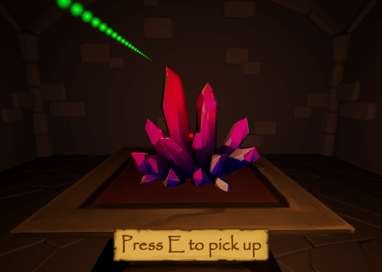
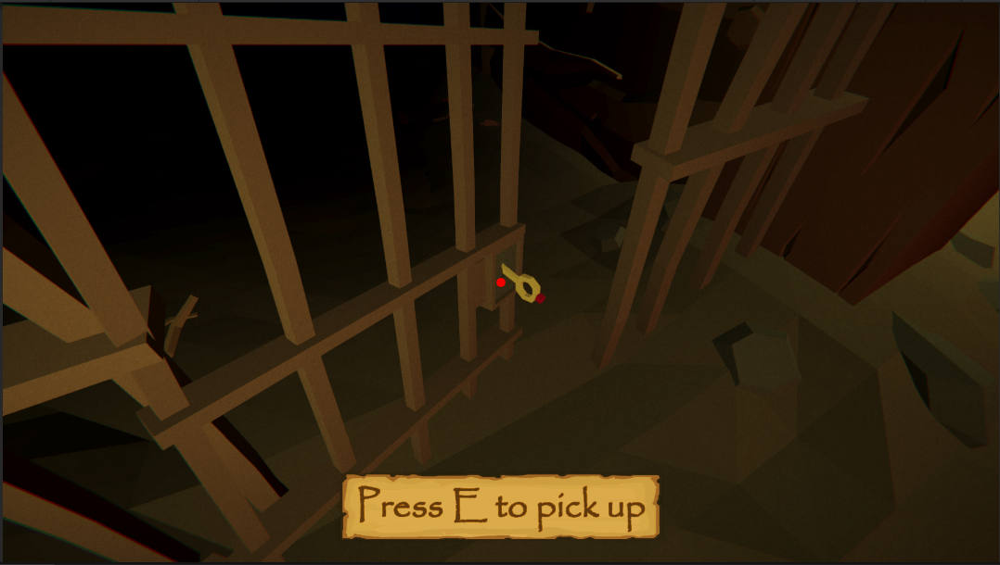

# FugueState

>You wake up with no memory of who you are, where you are ,and why. Your mind is a mess and terrible noises haunt you. Escape and find out what happened. ''Fugue State'' is a first person 3D mystery, puzzle game with a dark atmosphere.

<b>Explore different rooms and areas:</b>

  

  
<b>Read the notes to get information.</b> 

  

  
<b>Solve puzzles to progress.</b> 

  
  
  
<b>Collect items to help you escape.</b> 

  

------------
<b>Installation Instractions</b>
 
A project created at the Global Game Jam 2021:  <a href = "https://globalgamejam.org/2021/games/fugue-state-5">Read the instructions and download it here</a>

------------

Credits
============

FUGUE STATE
by Lovecraft's Parable

PROGRAMMING: Christos Krilis, Kostas Kalatzis, Sotiris Georgakopoulos

TECHNICAL ANIMATION: Christos Krilis

CONCEPT: Lovecraft's Parable

GAME DESIGN: Lovecraft's Parable

UI & VISUAL DESIGN: Christos Krilis, Kostas Kalatzis, Sotiris Georgakopoulos

MUSIC & SOUND DESIGN: Valentina Pouska

SCENARIO & NARRATIVE DESIGNER: Pavlos Laguretos

SPECIAL THANKS

eΝVy Softworks | Gambrinous | Broken Vector

CREATED AT THE 2021 GLOBAL GAME JAM
